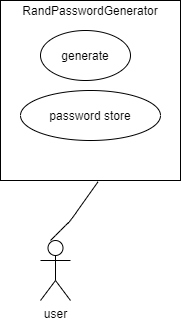

# Pay Station

## Project Abstract
This project is use to generate password for user. It can use key to generate password, and also can let use decide the length, component. Also, it can decrypt key by using this project. 

## Project Relevance
This is pretty basic object oriented design open source project. And this make project can do a lot of stuff.

## Conceptual Design
Implement hash to make it able to safely store in any cloud serves, and keep a decryptor file bring with user to make it access at any location. Also, create a database that store encrypt password file able to carry with user

## Background
_A URL reference to the project. Add text on how to build and run succesfully._ 

https://github.com/nsacyber/RandPassGenerator

***Building***
- need use with JRE 8.0 or higher.

**Running**
- just use command " java -jar RandPassGenerator.jar  [options]"

## Required Resources
- _Group members competencies_
- _Hardware and software resource required_
